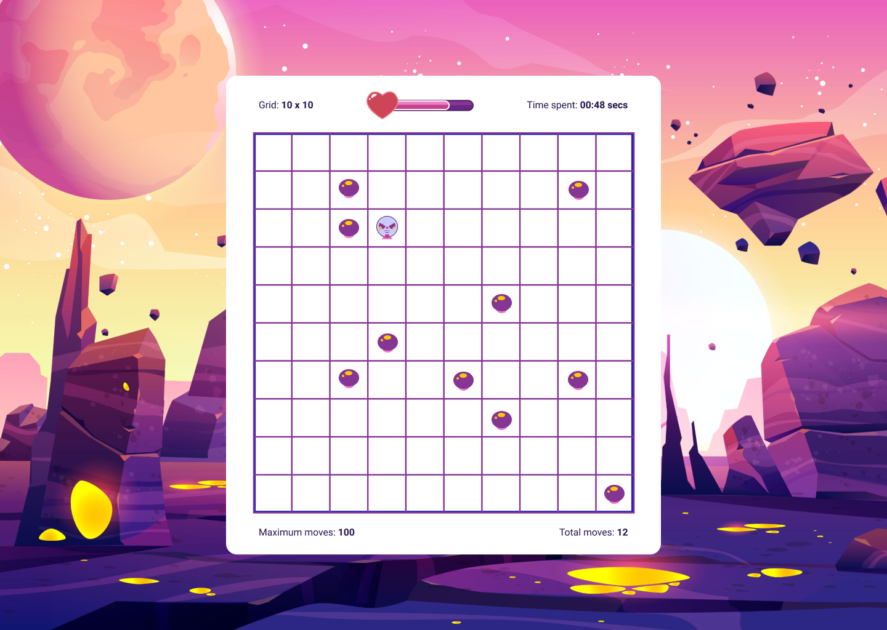

# Greedy Hunter

A game where one has to eat all food items before they run out of moves



## How To Play?

- Using the WASD or Arrow keys to move the player around
- Consume food items closests to you
- Ensure you don't run out of moves before cosuming all food items

## Prerequisites

- A local installation of Node.js, v12 or higher

## Getting Started

The game was created using Create React App. To get started, clone this repo

```
git clone https://github.com/vicradon/greedy_hunter.git
```

Change directory into the repo and install dependencies

```
cd greedy_hunter;
npm i
```

Run the local dev server using

```
npm start
```

## Contributing

Feel free to make a PR if any bug is encountered

## LICENCE

[MIT](/LICENCE)

This repo is licenced under the MIT Licence.
Copyright &copy; 2021, Osinachi Chukwujama
